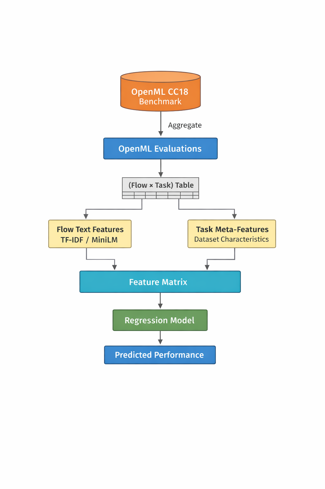

# OpenML Flow Performance Prediction

This repository contains a **minimal research pipeline for predicting the benchmark performance of machine learning flows on OpenML tasks**.

The code focuses on the **OpenML-CC18 benchmark suite** and explores whether the performance of ML pipelines can be predicted from:

- textual descriptions of flows (e.g. sklearn pipelines),
- dataset/task metafeatures,
- or their combination.

The implementation is intentionally **minimal, transparent, and reproducible**, designed for experimentation and research prototyping.

---

# Research Idea

The goal is to learn a predictive function: f(flow description, task metafeatures) → expected performance


where performance is measured using **predictive accuracy** on the OpenML CC18 benchmark.

The pipeline predicts performance for each **flow × task** pair.



---

# Features

The pipeline supports:

### Flow Representation
Flows are represented using textual metadata extracted from OpenML:

- flow name
- pipeline structure
- version information
- external version metadata

Example:
```
sklearn.pipeline.Pipeline(
Imputer=sklearn.preprocessing.Imputer,
OneHotEncoder=sklearn.preprocessing.OneHotEncoder,
Classifier=RandomForestClassifier
)
```

---

### Text Representations

Supported text representations:

| Method | Description |
|------|-------------|
| TF-IDF | Bag-of-words model for pipeline descriptions |
| MiniLM | Sentence-transformer embeddings |
| None | Use only task metafeatures |

---

### Task Metafeatures

Dataset characteristics from OpenML tasks are used as numeric features:

Examples include:

- NumberOfInstances
- NumberOfFeatures
- NumberOfClasses
- NumberOfMissingValues
- NumberOfNumericFeatures
- NumberOfSymbolicFeatures

---

### Target Aggregation

Performance is aggregated from OpenML evaluations using:

| Mode | Meaning |
|----|------|
| `mean` | average performance across runs |
| `max` | best observed performance |

---

### Evaluation Protocols

Two cross-validation schemes are implemented:

**1. Row KFold**

Random splits over `(flow × task)` pairs.

Used as the primary evaluation.

---

**2. Task Group KFold**

Splits by task.

This tests **generalization to unseen datasets**.

---

### Models

Three baseline regressors are implemented:

- Ridge regression
- Random Forest
- Extra Trees

---

### Statistical Testing

The pipeline includes:

- Wilcoxon signed-rank test
- permutation feature importance

---

### Caching

Expensive steps are cached:

- OpenML downloads
- TF-IDF vectorization
- MiniLM embeddings

Cache directory: minimal_cache_cc18/


---

# Repository Structure
```
openml_flow_minimal_cc18.py
README.md
notebooks.ipynb
```


Main script: openml_flow_minimal_cc18.py


Contains:

- OpenML data loading
- preprocessing
- feature construction
- model training
- evaluation
- statistical analysis

---

# Installation

Create a Python environment and install dependencies:

```bash
pip install numpy pandas scikit-learn scipy openml joblib sentence-transformers
```

# Example usage
```
import openml

from openml_flow_minimal_cc18 import (
    load_cc18_from_openml,
    run_cc18_pipeline,
    DiskCache
)

# Load flows (example placeholder)
flows = openml.flows.list_flows(size=1000)

# Load benchmark suite
cache = DiskCache("minimal_cache_cc18")

bundle = load_cc18_from_openml(
    function="predictive_accuracy",
    suite_name="OpenML-CC18",
    cache=cache
)

tasks_df = bundle["tasks_df"]
evals_df = bundle["evals_df"]

# Run experiment
out = run_cc18_pipeline(
    flows=flows,
    tasks_df=tasks_df,
    evals_df=evals_df,
    agg_mode="mean",
    text_mode="tfidf",
    use_task_metafeatures=True,
    run_row_kfold=True,
    run_task_group_kfold=True,
    cv_folds=5
)

print(out["summary"])
```

## Standard Experiments

The helper function `run_standard_cc18_experiments` executes a standard set of experiments:

- TF-IDF only
- Metafeatures only
- TF-IDF + metafeatures

with both aggregation modes:

- mean
- max

Example:
```
from openml_flow_minimal_cc18 import run_standard_cc18_experiments

results = run_standard_cc18_experiments(
    flows=flows,
    tasks_df=tasks_df,
    evals_df=evals_df
)
```

## Output

Results are stored in:
```
minimal_results_cc18/
```

Each run produces:
```
cv_results.csv
summary.csv
wilcoxon_row_kfold_mse.csv
wilcoxon_task_group_kfold_mse.csv
pipeline_artifacts.joblib
```


