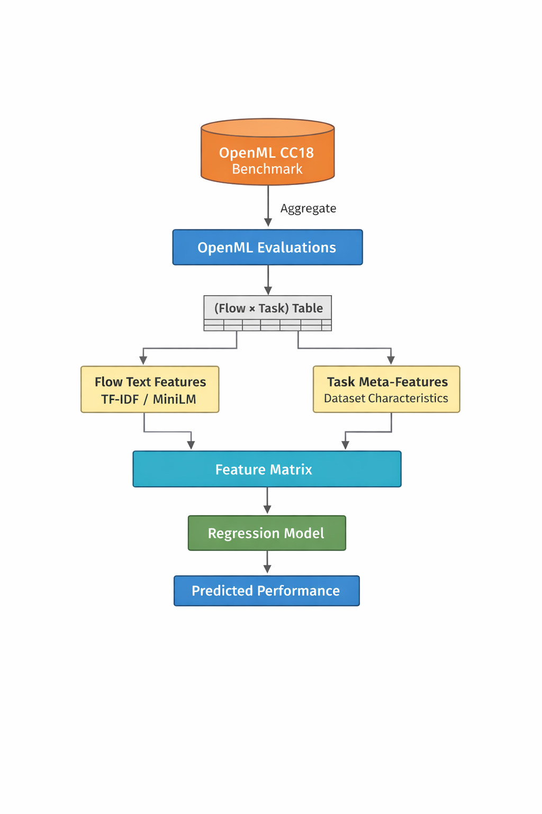

# OpenML Flow Performance Prediction

This repository contains a **research pipeline for predicting the benchmark performance of machine learning flows on OpenML tasks**, with a strong emphasis on cross-validation, statistical testing, and SHAP-based interpretability.

The code targets the **OpenML-CC18 benchmark suite** and explores whether the performance of ML pipelines can be predicted — and *explained* — from:

- textual descriptions of flows (e.g. sklearn pipelines),
- dataset/task metafeatures,
- or their combination.

The implementation is intentionally **minimal, transparent, and reproducible**, designed for experimentation and research prototyping.

---

# Research Idea

The goal is to learn a predictive function: `f(flow description, task metafeatures) → expected performance`

where performance is measured using **predictive accuracy** on the OpenML CC18 benchmark.
The pipeline predicts performance for each **flow × task** pair, and then uses TreeSHAP to study *which features drive those predictions* and how stable those explanations are.



---

# Features

### Flow Representation
Flows are represented using textual metadata extracted from OpenML:

- flow name
- pipeline structure
- version information
- external version metadata

Example:
```
sklearn.pipeline.Pipeline(
    Imputer=sklearn.preprocessing.Imputer,
    OneHotEncoder=sklearn.preprocessing.OneHotEncoder,
    Classifier=RandomForestClassifier
)
```

### Text Representations

| Method | Description |
|------|-------------|
| `tfidf` | Bag-of-words TF-IDF over pipeline descriptions |
| `minilm` | Sentence-transformer (MiniLM) embeddings |
| `none` | Use only task metafeatures |

Text matrices are cached on disk by content key so changing preprocessing or text content invalidates them correctly.

### Task Metafeatures

Numeric dataset characteristics from OpenML, e.g.:

- NumberOfInstances
- NumberOfFeatures
- NumberOfClasses
- NumberOfMissingValues
- NumberOfNumericFeatures
- NumberOfSymbolicFeatures

Feature names are namespaced `text::...` and `meta::...` so the SHAP readability metric can tell them apart.

### Target Aggregation

Per (task, flow) pair, multiple OpenML evaluations are collapsed via:

| Mode | Meaning |
|----|------|
| `mean` | average performance across runs |
| `max` | best observed performance |

### Evaluation Protocols

Two cross-validation schemes are implemented, and the **gap between them is a central result of the study**:

1. **`row_kfold`** — plain KFold over `(flow × task)` rows. A flow's other (task) rows can leak into training, so this is the optimistic / in-distribution estimate.
2. **`task_group_kfold`** — `GroupKFold` grouped by `task_id`, so all rows for a task stay in one fold. This is the honest generalization-to-new-tasks estimate, and the main protocol the notebooks use.

### Models

Four baseline regressors, exposed via `get_models(selected_models=...)`:

- `ridge` — Ridge regression
- `random_forest` — Random Forest
- `extra_trees` — Extra Trees
- `hist_gbrt` — Histogram Gradient Boosting (densified per-fold from the sparse matrix)

### SHAP-based Interpretability

When `compute_shap=True`, TreeSHAP global/local (and optionally interaction) values are computed per fold and reduced to:

- **Readability** of local explanations (fraction of top-k features that are human-interpretable `meta::...` features)
- **Sparsity** (number of features needed to capture a given mass)
- **Stability** (Jaccard overlap of top-k features across folds)
- **Interaction ratio** (off-diagonal vs. total SHAP-interaction mass)

### Statistical Testing

- Wilcoxon signed-rank tests for pairwise model comparison on MSE
- Permutation feature importance

### Caching

Two distinct layers:

- **`DiskCache`** (`minimal_cache_cc18/`) — content-addressed `joblib` cache used for the OpenML bundle and for TF-IDF/MiniLM feature matrices.
- **Per-run results dirs** (e.g. `results_cc18_max/<config_name>/`) holding `cv_results.csv`, `summary.csv`, Wilcoxon CSVs, SHAP CSVs, `shap_artifacts.pkl`, `pipeline_artifacts.joblib`, and `run_metadata.json`.

---

# Repository Structure

```
openml_flow.py        # the entire codebase: data → features → CV → SHAP → consolidation
experiments.ipynb     # run the experiment suite; writes per-run results + consolidated CSVs
figures.ipynb         # render the paper figures (PNG + PDF) from a results dir
figures_max.ipynb     # rendered figures for agg_mode="max"
figures_mean.ipynb    # rendered figures for agg_mode="mean"
lacci/                # LACCI 2026 paper: robust protocol, camera-ready experiments, figure/table checks
sncs/                 # SN Computer Science paper: the full vectorizer × regressor study
recommender/          # warm-start recommender line: 29 scripts + REPRODUCE.md
requirements.txt
legacy/               # superseded modules + notebooks, kept for reference (do not import)
```

`legacy/` holds three older modules and five older notebooks that `openml_flow.py` consolidated. They drifted out of sync and are kept only for historical reference.

---

# Papers in this repository

Two published studies use this data, with **different evaluation protocols and
therefore very different numbers**. Read this before comparing them:

| Directory | Paper | Protocol | Headline |
|---|---|---|---|
| [`sncs/`](sncs/) | *Learning from Prior Experiments: Meta-learning Models of Workflow Performance*, SN Computer Science ([10.1007/s42979-026-05295-9](https://doi.org/10.1007/s42979-026-05295-9)); extends the WEA 2025 conference paper | cross-validation over **shuffled splits of individual evaluations** — evaluations of a dataset seen in training may appear in the test fold | test *R²* ≈ 0.80 across 10 representations × 5 regressors |
| [`lacci/`](lacci/) | *Comparing Lexical and Dense Representations for Interpretable Workflow Recommendation*, LACCI 2026 | **task-grouped** folds — all rows of a task in one fold, repeated evaluations aggregated per pair | far lower *R²*; TF-IDF ≈ MiniLM predictively but far more explainable |

The gap between the two is the difference between interpolating within known
datasets and generalizing to entirely new ones — not a contradiction. Each
directory's README states its own protocol and maps the paper's tables and
figures to the code that produced them.

---

# Installation

```bash
pip install -r requirements.txt
```

`sentence-transformers` is only needed for `text_mode="minilm"`. OpenML access can use the `OPENML_API_KEY` env var (see `configure_openml`).

---

# Example Usage

```python
import openml_flow as wf

bundle = wf.load_cc18_from_openml(
    function="predictive_accuracy",
    suite_name="OpenML-CC18",
    cache=wf.DiskCache("minimal_cache_cc18"),
)
flows = wf.load_or_cache_flows(bundle["evals_df"], "minimal_cache_cc18/flows.joblib")

outputs = wf.run_experiment_configs(
    flows=flows,
    tasks_df=bundle["tasks_df"],
    evals_df=bundle["evals_df"],
    configs=[
        {"name": "tfidf_meta", "text_mode": "tfidf", "use_task_metafeatures": True},
        {"name": "meta_only",  "text_mode": "none",  "use_task_metafeatures": True},
    ],
    agg_mode="max",
    results_dir="results_cc18_max",
    selected_models=["hist_gbrt", "random_forest"],
    compute_shap=True,
)
wf.consolidate_experiments(outputs, "results_cc18_max")
```

The notebooks are thin orchestration over the module — edit the **Configuration** cell of `experiments.ipynb`, run it top-to-bottom to produce the results dirs, then run `figures.ipynb` pointed at one of those dirs.

### Quick offline sanity check

```python
wf.run_cc18_pipeline(
    flows=tiny_flows, tasks_df=tiny_tasks_df, evals_df=tiny_evals_df,
    text_mode="none", compute_shap=False,
    selected_models=["random_forest"], cv_folds=2,
)
```

---

# Output

Each call to `run_experiment_configs` writes one subdirectory per config under e.g. `results_cc18_max/`:

```
results_cc18_max/<config_name>/
    cv_results.csv
    summary.csv
    wilcoxon_row_kfold_mse.csv
    wilcoxon_task_group_kfold_mse.csv
    global_shap_*.csv
    local_shap_metrics_*.csv
    shap_summary_metrics.csv
    shap_artifacts.pkl
    pipeline_artifacts.joblib
    run_metadata.json
```

`consolidate_experiments` then writes the results-dir-level rollups read by `figures.ipynb`:

```
predictive_anchor.csv
shap_summary_metrics_all.csv
local_shap_metrics_summary.csv
```

---

# Licence

MIT licence — see [LICENSE](LICENSE).
